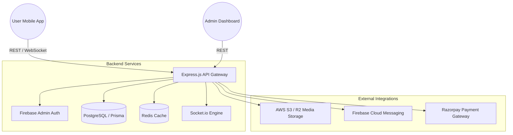
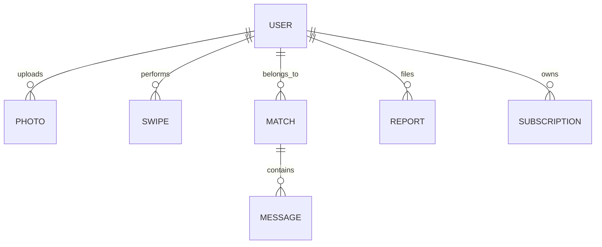

# 💖 MingleX - Premium AI-Driven Dating Platform


MingleX is an AI-driven dating application built for high-fidelity user experiences. Built with a robust **TypeScript** ecosystem, it features real-time discovery, AI-prioritized matchmaking, secure KYC verification, and a comprehensive administration suite.

---

## 🏗️ System Architecture

MingleX follows a modern, scalable architecture designed for real-time interactions. While the architecture supports cloud deployment (AWS/GCP), it is currently optimized for **local development and stress testing**.

### 🛠️ Local Testing Environment
- **Object Storage:** **Minio** (S3-compatible) for local media and KYC video handling.
- **Database:** Local **PostgreSQL** instance with Prisma ORM.
- **Real-time:** Local **Redis** for caching and Socket.io scaling.
- **Auth:** Firebase Admin SDK (Local Emulator compatible).



---

## ✨ Core Features

### 🔍 Discovery & Matchmaking
- **Algorithm-Driven Feed:** Proximity and preference-based profile discovery.
- **Smart Prioritization:** Profiles are ranked based on activity, completeness, and "Boost" status.
- **Mutual Match Logic:** Instant match creation upon mutual "Like" swipes.

### 🛡️ Trust & Safety (KYC)
- **Video-Based Verification:** Users upload short KYC videos for manual admin approval.
- **Moderation Queue:** High-risk profiles and reports are prioritized in the Admin dashboard.
- **Reporting & Appeals:** Comprehensive safety framework with automated shadow-banning.

### 💬 Real-Time Interactions
- **Instant Messaging:** Powered by Socket.io with delivery status and typing indicators.
- **Media Support:** Share images and voice notes (2-minute limit) within chats.
- **Video Calling:** Seamless 1-on-1 WebRTC video calls for verified matches.

### 💎 Premium Ecosystem
- **Tiered Subscriptions:** Free, Premium, and Elite tiers with granular feature gating.
- **Profile Boosts:** Increase visibility by 50% for 24 hours.
- **Razorpay Integration:** Secure, native payment flows for iOS and Android.

---

## 🛠️ Tech Stack

### Backend (The Engine)
- **Runtime:** Node.js (v20+) with TypeScript
- **Framework:** Express.js
- **ORM:** Prisma with PostgreSQL
- **Caching:** Redis (Session management & Rate limiting)
- **Real-time:** Socket.io
- **Validation:** Zod (Type-safe request validation)

### Mobile (The Experience)
- **Framework:** Expo / React Native
- **Styling:** NativeWind (TailwindCSS)
- **UI Components:** Gluestack UI
- **State Management:** Zustand
- **Navigation:** Expo Router (File-based)

### Infrastructure & Services
- **Auth:** Firebase Admin & Client SDK
- **Storage:** Minio (Local) / AWS S3 (Production)
- **Payments:** Razorpay Native SDK (Test Mode)
- **Notifications:** Firebase Cloud Messaging (FCM)

---

## 🔐 Security & Reliability

- **Authentication:** Dual-layer auth using Google OAuth and JWT with Redis-backed blacklisting.
- **Request Hardening:** Implemented `Helmet`, `HPP`, and `XSS-Clean` to prevent common web vulnerabilities.
- **Rate Limiting:** Granular limiters for Auth (5 req/min) and Discovery (100 req/15 min).
- **Sanitization:** Strict data sanitization and Zod-based schema enforcement.
- **Media Safety:** Sharp-based image compression and secure presigned URLs for media access.

## 🛣️ API Structure

The API is versioned (`/api/v1`) and follows RESTful principles.

| Module | Endpoints | Description |
| :--- | :--- | :--- |
| **Auth** | `POST /auth/google`, `POST /auth/refresh` | Firebase-integrated OAuth & Token rotation. |
| **User** | `GET /users/me`, `PUT /users/profile`, `POST /users/location` | Profile management and geolocation updates. |
| **Discovery** | `GET /discovery`, `POST /swipe` | Core swiping logic and feed generation. |
| **Chat** | `GET /chat/conversations`, `GET /chat/messages/:id` | Messaging history and participant metadata. |
| **Media** | `POST /media/upload`, `GET /media/presigned` | Secure AWS S3 uploads for photos and KYC. |
| **Admin** | `GET /admin/stats`, `POST /admin/users/:id/approve` | Moderation and system analytics. |

---

## 📊 Database Schema

Designed for high-performance lookups and integrity using PostgreSQL.

### Key Relationships
- **User ↔ Photo:** 1:N relationship with `status` gating (Approved/Rejected).
- **User ↔ Swipe:** Self-referential join table for bidirectional interactions.
- **Match ↔ Message:** Matches act as the parent container for real-time messaging.
- **Subscription ↔ Payment:** Transactional logs for revenue auditing.



---

## 🚀 Future Roadmap (Phase 2)

### 📈 Scaling & Optimization
- **Global Stress Testing:** Implementing K6 scripts to simulate 10k+ concurrent WebSocket connections.
- **Database Partitioning:** Horizontal scaling for the `Messages` and `Swipes` tables.

### 🎨 UI/UX Enhancements
- **Glassmorphic Redesign:** Implementing a premium, translucent design language across the mobile app.
- **Micro-Animations:** Integrating Lottie and Reanimated for high-engagement interactions.

### 🤖 Advanced AI
- **Semantic Matchmaking:** Using Vector Embeddings (PGVector) to match users based on interest descriptions.
- **Automated Moderation:** AI-based image scanning for inappropriate content using AWS Rekognition.

---

## ⚙️ Installation

1. **Clone the repository:**
   ```bash
   git clone https://github.com/your-username/minglex.git
   cd minglex
   ```

2. **Install Dependencies:**
   ```bash
   npm run install-all
   ```

3. **Configure Environment:**
   Fill in `.env` files in `backend/` and `mobile/` using the provided `.env.example` templates.

4. **Launch Services:**
   - **Backend:** `cd backend && npm run dev`
   - **Mobile:** `cd mobile && npx expo start`
   - **Admin:** `cd admin && npm run dev`

---

## 📄 License
Copyright © 2024 MingleX. All rights reserved. Professional implementation by **[Your Name/Team]**.
