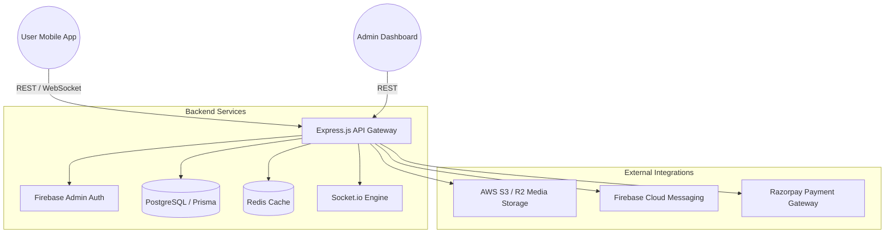
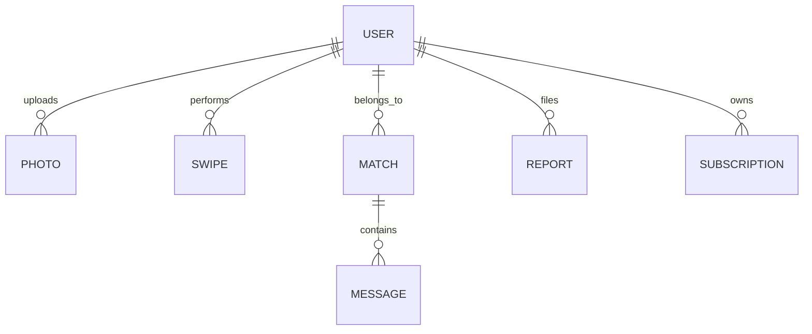

# 💖 MingleX - Premium AI-Driven Dating Platform


MingleX is an AI-driven dating application built for high-fidelity user experiences. Built with a robust **TypeScript** ecosystem, it features real-time discovery, AI-prioritized matchmaking, secure KYC verification, and a comprehensive administration suite.

---

## 🏗️ System Architecture

MingleX follows a modern, scalable architecture designed for real-time interactions. While the architecture supports cloud deployment (AWS/GCP), it is currently optimized for **local development and stress testing**.

### 🛠️ Local Testing Environment
- **Object Storage:** **Minio** (S3-compatible) for local media and KYC video handling.
- **Database:** Local **PostgreSQL** instance with Prisma ORM.
- **Real-time:** Local **Redis** for caching and Socket.io scaling.
- **Auth:** Firebase Admin SDK (Local Emulator compatible).


```mermaid
graph TD
    User((User Mobile App)) -->|REST / WebSocket| API[Express.js API Gateway]
    Admin((Admin Dashboard)) -->|REST| API
    
    subgraph "Backend Services"
        API --> Auth[Firebase Admin Auth]
        API --> DB[(PostgreSQL / Prisma)]
        API --> Cache[(Redis Cache)]
        API --> RealTime[Socket.io Engine]
    end
    
    subgraph "External Integrations"
        API --> S3[AWS S3 / R2 Media Storage]
        API --> SMS[Firebase Cloud Messaging]
        API --> Pay[Razorpay Payment Gateway]
    end
```

---

## ✨ Core Features

### 🔍 Discovery & Matchmaking
- **Algorithm-Driven Feed:** Proximity and preference-based profile discovery.
- **Smart Prioritization:** Profiles are ranked based on activity, completeness, and "Boost" status.
- **Mutual Match Logic:** Instant match creation upon mutual "Like" / "Super Like" swipes.

### 🛡️ Trust & Safety (KYC)
- **Video-Based Verification:** Users record a short KYC video (phone camera or laptop webcam) for manual admin approval. Videos are stored privately and only viewable by admins through signed links.
- **Moderation Queue:** High-risk profiles and reports are prioritized in the Admin dashboard.
- **Reporting & Appeals:** Comprehensive safety framework with automated shadow-banning.

### 💬 Real-Time Interactions
- **Instant Messaging:** Powered by Socket.io with delivery status and typing indicators.
- **Media Support:** Share images and voice notes (2-minute limit) within chats.
- **Video Calling:** Seamless 1-on-1 WebRTC video calls for verified matches.

### 💎 Premium Ecosystem
- **Tiered Subscriptions:** Free, Premium, and Elite tiers with granular feature gating.
- **Profile Boosts:** Increase visibility by 50% for 24 hours.
- **Razorpay Integration:** Secure, native payment flows for iOS and Android.

---

## 🛠️ Tech Stack

### Backend (The Engine)
- **Runtime:** Node.js (v20+) with TypeScript
- **Framework:** Express.js
- **ORM:** Prisma with PostgreSQL
- **Caching:** Redis (Session management & Rate limiting)
- **Real-time:** Socket.io
- **Validation:** Zod (Type-safe request validation)

### Mobile (The Experience)
- **Framework:** Expo / React Native
- **Styling:** NativeWind (TailwindCSS)
- **UI Components:** Gluestack UI
- **State Management:** Zustand
- **Navigation:** Expo Router (File-based)

### Infrastructure & Services
- **Auth:** Firebase Admin & Client SDK
- **Storage:** Minio (Local) / AWS S3 (Production)
- **Payments:** Razorpay Native SDK (Test Mode)
- **Notifications:** Firebase Cloud Messaging (FCM)

---

## 🔐 Security & Reliability

- **Authentication:** Dual-layer auth using Google OAuth and JWT with Redis-backed blacklisting.
- **Request Hardening:** Implemented `Helmet`, `HPP`, and `XSS-Clean` to prevent common web vulnerabilities.
- **Rate Limiting:** Granular limiters for Auth (5 req/min) and Discovery (100 req/15 min).
- **Sanitization:** Strict data sanitization and Zod-based schema enforcement.
- **Media Safety:** Sharp-based image compression and secure presigned URLs for media access.

## 🛣️ API Structure

The API is versioned (`/api/v1`) and follows RESTful principles.

| Module | Endpoints | Description |
| :--- | :--- | :--- |
| **Auth** | `POST /auth/google`, `POST /auth/verify`, `POST /auth/refresh` | Firebase-integrated OAuth, phone OTP & token rotation. |
| **User** | `GET /users/me`, `PUT /users/me`, `POST /users/location`, `POST /users/preferences`, `POST /users/interests` | Profile management and geolocation updates. |
| **Discovery** | `GET /discovery`, `POST /swipe` | Core swiping logic and feed generation. |
| **Chat** | `GET /chat/conversations`, `GET /chat/messages/:partnerId` | Messaging history and participant metadata. |
| **Media** | `POST /media/upload` (photo), `POST /media/kyc` (video), `POST /media/chat-upload`, `POST /media/upload-url` | Photo, KYC video and voice-note uploads to S3-compatible storage. |
| **Admin** | `GET /admin/stats`, `POST /admin/users/:id/approve` | Moderation and system analytics. |

---

## 📊 Database Schema

Designed for high-performance lookups and integrity using PostgreSQL.

### Key Relationships
- **User ↔ Photo:** 1:N relationship with `status` gating (Approved/Rejected).
- **User ↔ Swipe:** Self-referential join table for bidirectional interactions.
- **Match ↔ Message:** Matches act as the parent container for real-time messaging.
- **Subscription ↔ Payment:** Transactional logs for revenue auditing.


```mermaid
erDiagram
    USER ||--o{ PHOTO : uploads
    USER ||--o{ SWIPE : performs
    USER ||--o{ MATCH : belongs_to
    MATCH ||--o{ MESSAGE : contains
    USER ||--o{ REPORT : files
    USER ||--o{ SUBSCRIPTION : owns
```


---

## ⚙️ Running Locally

### Prerequisites
Node.js 20+, PostgreSQL, Redis, [MinIO](https://min.io/docs/minio/macos/index.html) and the [Firebase CLI](https://firebase.google.com/docs/cli) (`brew install postgresql redis minio firebase-cli`).

### 1. Install & configure (once)
```bash
git clone https://github.com/sidharthaxy/DatingApp.git
cd DatingApp
npm run install-all

cp backend/.env.example backend/.env    # then fill in the values
cp mobile/.env.example  mobile/.env     # then fill in the Firebase web config
# admin/.env needs: VITE_API_URL="http://localhost:8000/api/v1"

cd backend
npm run db:push        # create / update the database tables
npm run db:seed        # seed the interests shown during onboarding
```

### 2. Start everything
The app needs **five** things running. Postgres and Redis usually run as services (`brew services start postgresql redis`); the rest each take a terminal:

| # | What | Command | Port |
| :-- | :--- | :--- | :--- |
| 1 | Object storage (photos, KYC videos, voice notes) | `npm run services:storage` | 9000 |
| 2 | Firebase Auth emulator (local sign-in) | `npm run services:emulators` | 9099 |
| 3 | API + WebSocket server | `npm run backend:dev` | 8000 |
| 4 | The app | `npm run mobile:web` | 8081 |
| 5 | Admin dashboard (optional) | `npm run admin:dev` | 5173 |

The first time storage is started, run `npm --prefix backend run storage:init` to create the bucket and its access policy.

> If photo or KYC upload fails with *"Media storage is unreachable"*, MinIO (#1) is not running. If sign-in fails with *"Can't reach the Firebase Auth emulator"*, #2 is not running.

### 3. Use it
**In the laptop browser** — open **http://localhost:8081**. Use `localhost`, not your IP address: browsers only allow camera/microphone access on `localhost` or `https`. Sign in with *Continue with Google* (the emulator lets you invent an account), complete onboarding, and record the 5-second KYC video with your webcam.

**On a phone** — run `npm run mobile:start` and scan the QR code with Expo Go (same Wi-Fi, Expo Go for SDK 55). The app rewrites `localhost` to your computer's address automatically. For profile photos to load on the phone, also set `STORAGE_PUBLIC_URL="http://<your-LAN-IP>:9000"` in `backend/.env`. Features that rely on native modules — phone-number login, push notifications, video calls and Razorpay checkout — need a development build (`npx expo run:ios` / `npx expo run:android`) with your `google-services.json` / `GoogleService-Info.plist` added; in Expo Go they show a message instead of crashing.

> **Verification status:** the browser build is exercised end to end (sign-in, onboarding, KYC video, discovery, matching, chat, voice notes, video calls, admin review). The native camera/recording path has been reworked but has not yet been run on a physical device.

**Approving members** — new profiles are `UNDER_REVIEW`: they can browse, but are only shown to others once approved. Open the admin dashboard (http://localhost:5173, first login `admin@minglex.com` / `admin123`, which you are then asked to change), watch the KYC video and approve.

### Tests
```bash
npm run backend:test     # API test-suite (uses the separate database in backend/.env.test)
```

### Member flow
```
Sign in → Terms → Onboarding (profile, preferences, location, interests, photo)
        → KYC video → Discovery ⇄ Messages ⇄ Profile
```
Discovery stays locked until the profile is complete **and** a KYC video has been submitted. KYC can be skipped and done later from the Profile tab.
