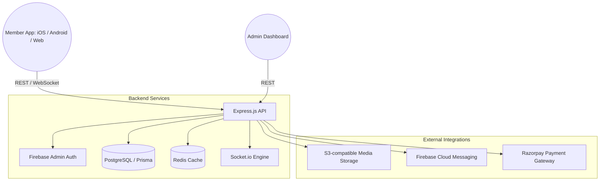
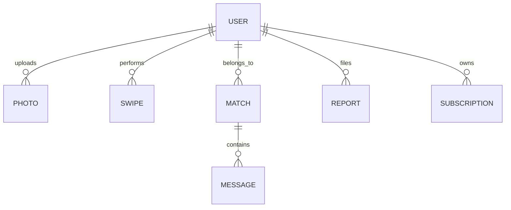

# 💖 MingleX - Premium AI-Driven Dating Platform


MingleX is a dating application built on an end-to-end **TypeScript** stack. One codebase runs as an iOS / Android app and in the browser, with compatibility-scored discovery, video KYC verification, real-time chat and calls, subscriptions, and an admin dashboard for moderation.

| Folder | What it is |
| :--- | :--- |
| [`mobile/`](mobile/) | The member app (Expo / React Native — iOS, Android and web) |
| [`backend/`](backend/) | REST + WebSocket API (Express, Prisma, Socket.io) |
| [`admin/`](admin/) | Moderation dashboard (React + Vite) |

More docs: [project roadmap](project_roadmap.md) · [deployment guide](deployment_guide.md) · [Postman collection](rest_apis_collection.json) · Swagger UI at `http://localhost:8000/api-docs` while the backend runs.

---

## 🏗️ System Architecture

MingleX follows a modern, scalable architecture designed for real-time interactions. While the architecture supports cloud deployment (AWS/GCP), it is currently optimized for **local development and stress testing**.

### 🛠️ Local Testing Environment
- **Object Storage:** **Minio** (S3-compatible) for local media and KYC video handling.
- **Database:** Local **PostgreSQL** instance with Prisma ORM.
- **Cache:** Local **Redis** for the discovery cache, online presence and logged-out token blacklist.
- **Auth:** Firebase Admin SDK against the local Firebase Auth emulator.


```mermaid
graph TD
    User((Member App: iOS / Android / Web)) -->|REST / WebSocket| API[Express.js API]
    Admin((Admin Dashboard)) -->|REST| API
    
    subgraph "Backend Services"
        API --> Auth[Firebase Admin Auth]
        API --> DB[(PostgreSQL / Prisma)]
        API --> Cache[(Redis Cache)]
        API --> RealTime[Socket.io Engine]
    end
    
    subgraph "External Integrations"
        API --> S3[S3-compatible Media Storage]
        API --> Push[Firebase Cloud Messaging]
        API --> Pay[Razorpay Payment Gateway]
    end
```

---

## ✨ Core Features

### 🔍 Discovery & Matchmaking
- **Algorithm-Driven Feed:** Proximity and preference-based profile discovery with age, distance and activity filters.
- **Smart Prioritization:** Profiles are ranked by recent activity, newness and "Boost" status, each with a 0–100% compatibility score (interests, goals, age, distance).
- **Daily Picks:** A refreshed set of recommendations every morning (manual refreshes: Free 1/day, Premium 3/day, Elite unlimited).
- **Mutual Match Logic:** Instant match creation upon mutual "Like" / "Super Like" swipes.

### 🛡️ Trust & Safety (KYC)
- **Video-Based Verification:** Users record a short KYC video (phone camera or laptop webcam) for manual admin approval. Videos are stored privately and only viewable by admins through signed links.
- **Moderation Queue:** Admins watch the KYC video and approve or reject; reports against the most-reported members are listed first.
- **Reporting & Appeals:** Members can report each other; heavily reported profiles are automatically hidden from discovery, and banned members can appeal.
- **Safety Center:** Emergency contacts and a panic button.

### 💬 Real-Time Interactions
- **Instant Messaging:** Powered by Socket.io with read receipts, typing indicators and online status.
- **Voice Notes:** Record and send voice notes (2-minute limit) within chats.
- **Video Calling:** 1-on-1 WebRTC video calls between matches, with an incoming-call prompt.

### 💎 Premium Ecosystem
- **Tiered Subscriptions:** Free, Premium, and Elite tiers, billed weekly, monthly, quarterly or yearly.
- **Profile Boosts:** A 30-minute ranking boost in discovery (payment for boosts is still mocked).
- **Razorpay Integration:** Native checkout on iOS / Android and hosted checkout in the browser, with server-side signature verification.

---

## 🛠️ Tech Stack

### Backend (The Engine)
- **Runtime:** Node.js (v20+) with TypeScript
- **Framework:** Express.js
- **ORM:** Prisma with PostgreSQL
- **Caching:** Redis (discovery cache, presence, token blacklist)
- **Real-time:** Socket.io
- **Validation:** Zod (Type-safe request validation)

### App (The Experience)
- **Framework:** Expo SDK 55 / React Native, also built for the web with React Native Web
- **Styling:** NativeWind (TailwindCSS)
- **UI Components:** Gluestack UI
- **State Management:** Zustand
- **Navigation:** Expo Router (File-based)

### Infrastructure & Services
- **Auth:** Firebase Admin & Client SDK
- **Storage:** MinIO (Local) / AWS S3 or Cloudflare R2 (Production)
- **Payments:** Razorpay (Test Mode)
- **Notifications:** Firebase Cloud Messaging (FCM)

---

## 🔐 Security & Reliability

- **Authentication:** Firebase sign-in (Google or phone OTP) exchanged for a 15-minute JWT plus a rotating refresh token; logged-out tokens are blacklisted in Redis. Admins use a separate email / password login.
- **Request Hardening:** `Helmet`, `HPP`, and an HTML-stripping filter on request bodies.
- **Rate Limiting:** Per-IP limits — 1,500 requests / 15 min overall, 30 sign-in attempts / 15 min and 50 swipes / min in production (relaxed in development, tunable with `RATE_LIMIT_*`).
- **Validation:** Zod schemas and enum checks on input.
- **Media Safety:** Photos are re-encoded with Sharp; KYC videos are private and only reachable through short-lived signed URLs.

## 🛣️ API Structure

The API is versioned (`/api/v1`) and follows RESTful principles.

| Module | Endpoints | Description |
| :--- | :--- | :--- |
| **Auth** | `POST /auth/google`, `POST /auth/verify`, `POST /auth/refresh` | Firebase-integrated OAuth, phone OTP & token rotation. |
| **User** | `GET /users/me`, `PUT /users/me`, `POST /users/location`, `POST /users/preferences`, `POST /users/interests` | Profile management and geolocation updates. |
| **Discovery** | `GET /discovery`, `POST /swipe`, `GET /recommendations` | Feed generation, swiping (`LIKE` / `DISLIKE` / `SUPER_LIKE`) and daily picks. |
| **Chat** | `GET /chat/conversations`, `GET /chat/messages/:partnerId` | Messaging history and participant metadata. |
| **Media** | `POST /media/upload` (photo), `POST /media/kyc` (video), `POST /media/chat-upload`, `POST /media/upload-url` | Photo, KYC video and voice-note uploads to S3-compatible storage. |
| **Admin** | `POST /admin/auth/login`, `GET /admin/users`, `POST /admin/users/:id/approve`, `GET /admin/stats` | Moderation and system analytics. |
| **More** | `/favorites`, `/wishlists`, `/reports`, `/appeals`, `/subscriptions`, `/safety`, `/social` | Favourites, lists, reporting, payments, safety and social features. |

Real-time messaging, typing, presence and call signalling run over Socket.io on the same host.

---

## 📊 Database Schema

Designed for high-performance lookups and integrity using PostgreSQL.

### Key Relationships
- **User ↔ Photo:** 1:N relationship with `status` gating (Approved/Rejected).
- **User ↔ Swipe:** Self-referential join table for bidirectional interactions.
- **Match ↔ Message:** Matches act as the parent container for real-time messaging.
- **Subscription ↔ Payment:** Transactional logs for revenue auditing.


```mermaid
erDiagram
    USER ||--o{ PHOTO : uploads
    USER ||--o{ SWIPE : performs
    USER ||--o{ MATCH : belongs_to
    MATCH ||--o{ MESSAGE : contains
    USER ||--o{ REPORT : files
    USER ||--o{ SUBSCRIPTION : owns
```


---

## ⚙️ Running Locally

### Prerequisites
Node.js 20+, PostgreSQL, Redis, [MinIO](https://min.io/docs/minio/macos/index.html) and the [Firebase CLI](https://firebase.google.com/docs/cli) (`brew install postgresql redis minio firebase-cli`).

### 1. Install & configure (once)
```bash
git clone https://github.com/sidharthaxy/DatingApp.git
cd DatingApp
npm run install-all

cp backend/.env.example backend/.env    # then fill in the values
cp mobile/.env.example  mobile/.env     # then fill in the Firebase web config
# admin/.env needs: VITE_API_URL="http://localhost:8000/api/v1"

cd backend
npm run db:push        # create / update the database tables
npm run db:seed        # seed the interests shown during onboarding
```

### 2. Start everything
The app needs **five** things running. Postgres and Redis usually run as services (`brew services start postgresql redis`); the rest each take a terminal:

| # | What | Command | Port |
| :-- | :--- | :--- | :--- |
| 1 | Object storage (photos, KYC videos, voice notes) | `npm run services:storage` | 9000 |
| 2 | Firebase Auth emulator (local sign-in) | `npm run services:emulators` | 9099 |
| 3 | API + WebSocket server | `npm run backend:dev` | 8000 |
| 4 | The app | `npm run mobile:web` | 8081 |
| 5 | Admin dashboard (optional) | `npm run admin:dev` | 5173 |

The first time storage is started, run `npm --prefix backend run storage:init` to create the bucket and its access policy.

> If photo or KYC upload fails with *"Media storage is unreachable"*, MinIO (#1) is not running. If sign-in fails with *"Can't reach the Firebase Auth emulator"*, #2 is not running.

### 3. Use it
**In the laptop browser** — open **http://localhost:8081**. Use `localhost`, not your IP address: browsers only allow camera/microphone access on `localhost` or `https`. Sign in with *Continue with Google* (the emulator lets you invent an account), complete onboarding, and record the 5-second KYC video with your webcam.

**On a phone** — run `npm run mobile:start` and scan the QR code with Expo Go (same Wi-Fi, Expo Go for SDK 55). The app rewrites `localhost` to your computer's address automatically. For profile photos to load on the phone, also set `STORAGE_PUBLIC_URL="http://<your-LAN-IP>:9000"` in `backend/.env`. Features that rely on native modules — phone-number login, push notifications, video calls and Razorpay checkout — need a development build (`npx expo run:ios` / `npx expo run:android`) with your `google-services.json` / `GoogleService-Info.plist` added; in Expo Go they show a message instead of crashing.

> **Verification status:** the browser build is exercised end to end (sign-in, onboarding, KYC video, discovery, matching, chat, voice notes, video calls, admin review). The native camera/recording path has been reworked but has not yet been run on a physical device.

**Approving members** — new profiles are `UNDER_REVIEW`: they can browse, but are only shown to others once approved. Open the admin dashboard (http://localhost:5173, first login `admin@minglex.com` / `admin123`, which you are then asked to change), watch the KYC video and approve.

**Forgot the admin password?** Run `npm --prefix backend run admin:reset` to set it back to `admin@minglex.com` / `admin123`.

### Tests
```bash
npm run backend:test     # API test-suite (uses the separate database in backend/.env.test)
```

### Member flow
```
Sign in → Terms → Onboarding (profile, preferences, location, interests, photo)
        → KYC video → Discovery ⇄ Messages ⇄ Profile
```
Discovery stays locked until the profile is complete **and** a KYC video has been submitted. KYC can be skipped and done later from the Profile tab.

### Troubleshooting
| Symptom | Cause |
| :--- | :--- |
| "Media storage is unreachable" on photo / KYC upload | MinIO is not running (`npm run services:storage`) |
| "Can't reach the Firebase Auth emulator" on sign-in | The emulator is not running (`npm run services:emulators`) |
| "Can't reach the server" | The backend is not running, or Postgres / Redis is down (the backend prints which) |
| Camera says "Browsers only allow camera access on https or localhost" | Open `http://localhost:8081`, not your IP address |
| No interests to pick in onboarding | Run `npm --prefix backend run db:seed` |
| Discovery says "Verify to start discovering" | Record the KYC video (Profile tab → verification status) |
| You never appear in someone else's discovery | Your profile is still `UNDER_REVIEW` — approve it in the admin dashboard |
